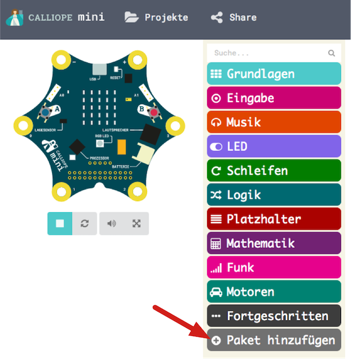
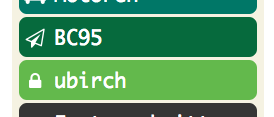
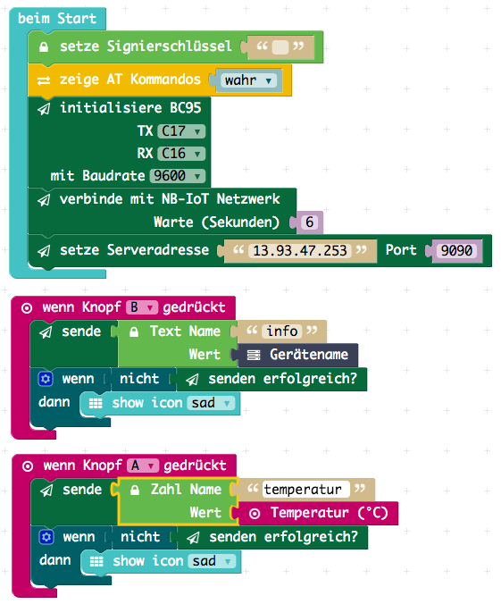

[](https://ubirch.com)

# Calliope mini Entwicklung mit MakeCode (PXT) Editor

1. [Online Editor](#online)
2. [Programme entwickeln und ausführen](#programme-entwicklen-und-ausführen)
    1. [BC95 Editor Paket installieren](#bc95-erweiterung-installieren)
    2. [Entwickeln von Programmen](#entwickeln-von-programmen)
3. [Offline Editor Alternative](#offline-alternative)
    
# Online 
Die einfachste Variante mit dem Entwickeln zu starten, ist der online Editor.

> [http://pxt.calliope.cc](http://pxt.calliope.cc)

# Programme entwicklen und ausführen

## BC95 Erweiterung installieren

Bevor das [BC95 Modul](http://www.quectel.com/product/bc95.htm) zusammen mit dem [Calliope mini](https://calliope.cc)
benutzt werden kann, muss ein Erweiterungsmodul im Editor hinzugefügt werden:

1. Paket hinzufügen anklicken<br/> 
2. `pxt-calliope-bc95` auswählen<br/>
3. Die Blockgruppe `BC95` erscheint jetzt in der Liste<br/>

## Entwickeln von Programmen

Um einfach zu starten, einfach das [Beispielprojekt herunterladen](https://raw.githubusercontent.com/ubirch/telekom-nbiot-hackathon-2017/master/mini-DE-NB-IoT-Example.hex) und per drag & drop auf das Editorfenster ziehen.
Das ganze sollte dann so aussehen:



Der Javascript Code dazu sieht folgendermassen aus:

```typescript
basic.forever(() => {
    bc95.sendNumber(
        "temperatur",
        input.temperature()
    )
    bc95.sendNumber(
        "licht",
        input.lightLevel()
    )
    basic.pause(10000)
})
bc95.init(
    SerialPin.C17,
    SerialPin.C16,
    BaudRate.BaudRate9600
)
bc95.attach(
    6
)
bc95.setServer("13.93.47.253", 9090)
```

> Nachdem ein Programm erstellt wurde, kann dieses heruntergeladen werden und muss dann erneut auf 
> das USB Laufwerk `MINI` kopiert werden.

# Offline Alternative
Alternativ kann der Editor auch heruntergeladen werden, um ihn lokal laufen 
zu lassen. Dafuer ist [Node.js](https://nodejs.org/en/), oder ein existierender
lokaler Webserver notwendig. 

- [Editor herunterladen](https://github.com/calliope-mini/pxt-calliope-static/archive/master.zip)
- Datei `pxt-calliope-static-master.zip` auspacken
- [Node.js](https://nodejs.org/en/) herunterladen und installieren
- Web server installieren (Kommandozeile): `npm install -g http-server`

Jetzt muß noch der Webserver gestartet werden. Dazu bitte (auf der Kommandozeile)
in das ausgepackte Verzeichnis `pxt-calliope-static-master` wechseln und dieses
Kommando ausführen:

```
http-server -c-1 pxt-calliope-static/release
```

Jetzt kann der Editor lokal benutzt werden. Einfach diese Adresse in einem
Browser öffnen: [http://localhost:8080](http://localhost:8080).
