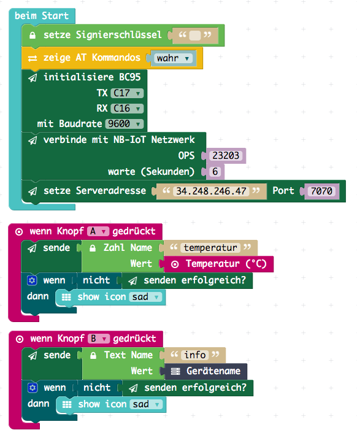

[](https://ubirch.com)

# Calliope mini Entwicklung mit MakeCode (PXT) Editor

1. [Online Editor](#online)
2. [Programme entwickeln und ausführen](#programme-entwicklen-und-ausführen)
    1. [ubirch Editor Paket installieren](#ubirch-erweiterung-installieren)
    2. [Entwickeln von Programmen](#entwickeln-von-programmen)
        1. [Geheimen Schlüssel erzeugen](#geheimen-schlüssel-erzeugen)
        2. [Gerät am Backend anmelden](#gerät-am-backend-anmelden)
3. [Offline Editor Alternative](#offline-alternative)
    
# Online 

Die einfachste Variante mit dem Entwickeln zu starten, ist der online Editor.

> [http://pxt.calliope.cc](http://pxt.calliope.cc)

# Programme entwicklen und ausführen

## ubirch Erweiterung installieren

Bevor das [BC95 Modul](http://www.quectel.com/product/bc95.htm) zusammen mit dem [Calliope mini](https://calliope.cc)
und dem [ubirch](http://ubirch.com/) Backend benutzt werden kann, muss ein Erweiterungsmodul im Editor hinzugefügt werden:

1. Paket hinzufügen anklicken<br/> 
2. `pxt-ubirch` auswählen<br/>
3. Die Blockgruppe `ubirch` erscheint jetzt zusammen mmit `BC95` in der Liste<br/>

## Entwickeln von Programmen

Um einfach zu starten, einfach das [Beispielprojekt herunterladen](https://raw.githubusercontent.com/ubirch/telekom-nbiot-hackathon-2017/master/de-ubirch-NB-IoT-Messaging.hex) (rechts Klick und Herunterladen als ...) und per drag & drop auf das Editorfenster ziehen.
Das ganze sollte dann so aussehen:

>PXT arbeitet asynchron, deshalb sollten beide Knöpfe nicht zu schnell hintereinander gedrückt werden, da sich sonst das
>BC95 aufhängt und erst durch Calliope mini reset wiederbelebt werden kann.



Der Javascript Code dazu sieht folgendermassen aus:

```typescript
input.onButtonPressed(Button.B, () => {
    bc95.send(
        ubirch.createStringMessage(
            "info",
            control.deviceName()
        )
    )
    if (!(bc95.sendOk())) {
        basic.showIcon(IconNames.Sad)
    }
})
input.onButtonPressed(Button.A, () => {
    bc95.send(
        ubirch.createNumberMessage(
            "temperatur",
            input.temperature()
        )
    )
    if (!(bc95.sendOk())) {
        basic.showIcon(IconNames.Sad)
    }
})
ubirch.setSignKey("") // <-- HIER MUSS NOCH DER Signierschlüssel hin!
modem.enableDebug(true)
bc95.init(
    SerialPin.C17,
    SerialPin.C16,
    BaudRate.BaudRate9600
)
bc95.attach(
    6
)
bc95.setServer("13.93.47.253", 9090)
```

> Nachdem ein Programm erstellt wurde, kann dieses heruntergeladen werden und muss dann erneut auf 
> das USB Laufwerk `MINI` kopiert werden.

> Achtung! PXT hat keine Unterstützung für Fliesskommazahlen!

### Gerät am Backend anmelden

Um mit dem Backend zu arbeiten, muss die ID des Calliope mini herausgefunden werden: [deviceinfo.hex](https://raw.githubusercontent.com/ubirch/telekom-nbiot-hackathon-2017/master/deviceinfo.hex)
auf den Calliope mini spielen. Auf dem Display wird dann die ID als eine HEX Zeichenkette ausgegeben (z.B. `id:AB12CD34`).

### Geheimen Schlüssel erzeugen

Mit dem script [ecc-generate.py](nbiot-cpp-template/ecc-generate.py) kann auf einer Kommandozeile ein ECC Schlüssel
erzeugt werden. Der private Schlüssel muss dann mit `setze Signierschlüssel` im Programm eingegeben werden. Das Script
registriert auch automatisch den öffentlichen Schlüssel beim backen.

*Weiter Informationen finden sich auf der Seite [Backend Anmeldung](de-backend-login.md).*

# Offline Alternative

Alternativ kann der Editor auch heruntergeladen werden, um ihn lokal laufen 
zu lassen. Dafuer ist [Node.js](https://nodejs.org/en/), oder ein existierender
lokaler Webserver notwendig. 

- [Editor herunterladen](https://github.com/calliope-mini/pxt-calliope-static/archive/master.zip)
- Datei `pxt-calliope-static-master.zip` auspacken
- [Node.js](https://nodejs.org/en/) herunterladen und installieren
- Web server installieren (Kommandozeile): `npm install -g http-server`

Jetzt muß noch der Webserver gestartet werden. Dazu bitte (auf der Kommandozeile)
in das ausgepackte Verzeichnis `pxt-calliope-static-master` wechseln und dieses
Kommando ausführen:

```
http-server -c-1 pxt-calliope-static/release
```

Jetzt kann der Editor lokal benutzt werden. Einfach diese Adresse in einem
Browser öffnen: [http://localhost:8080](http://localhost:8080).
