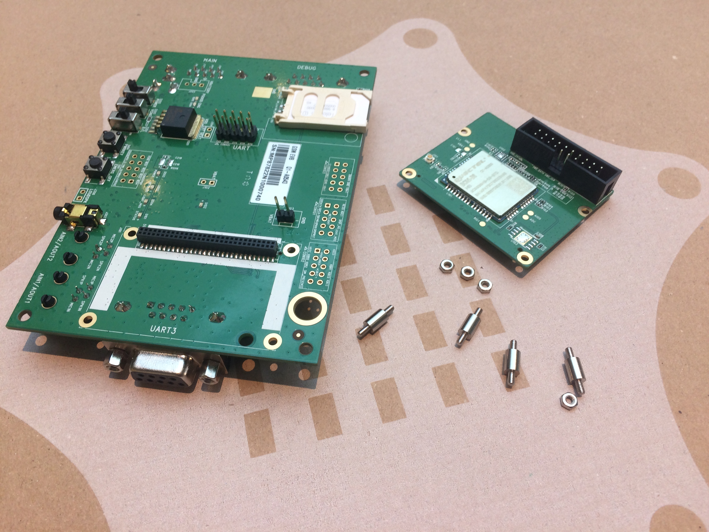
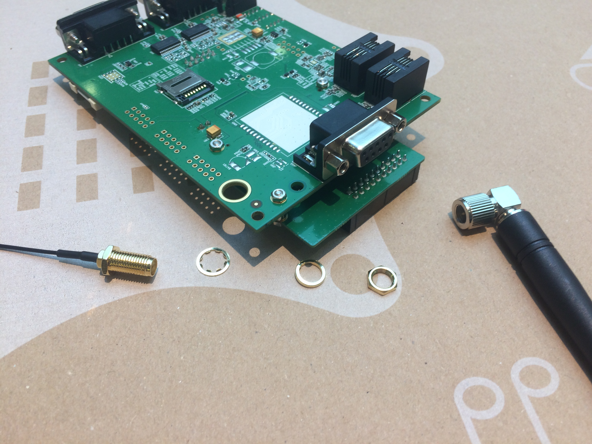
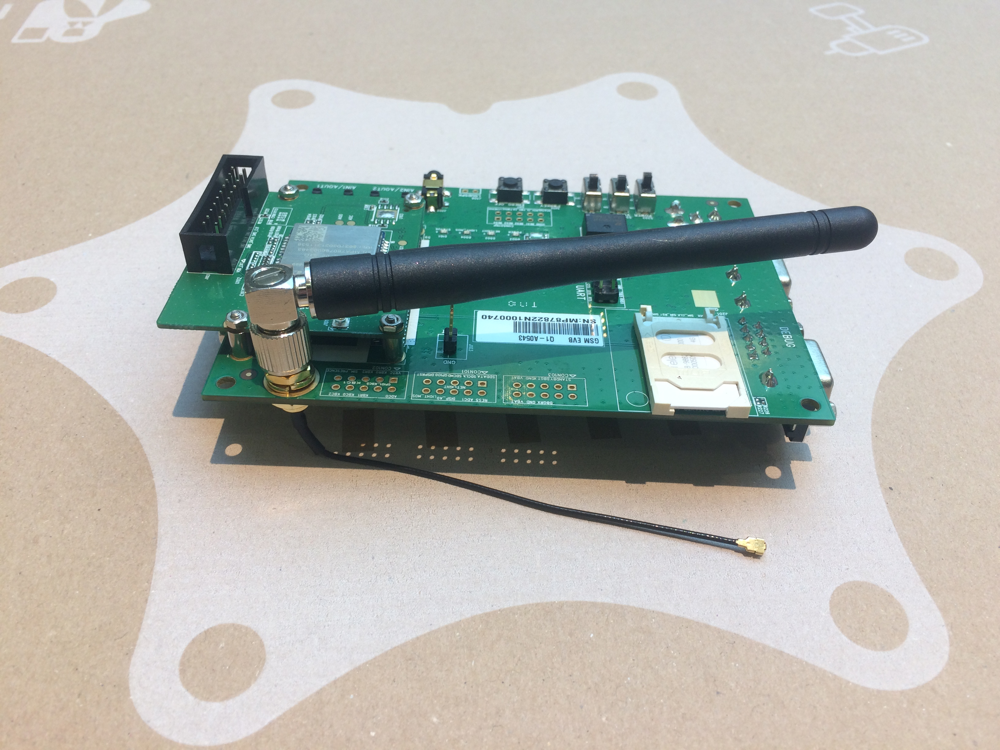
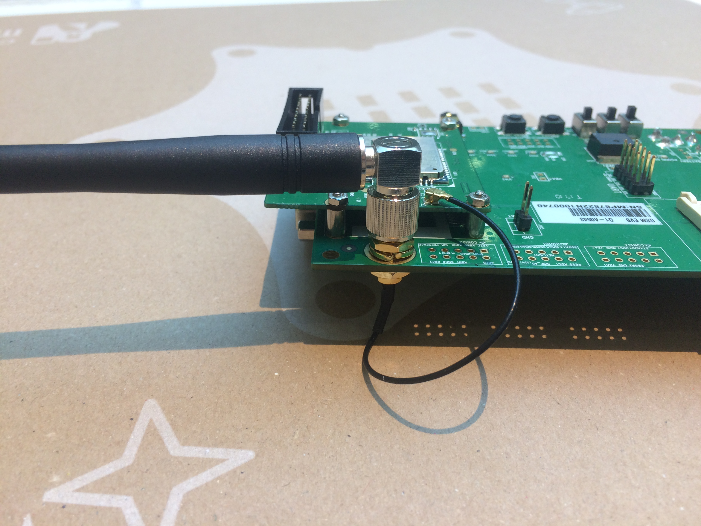
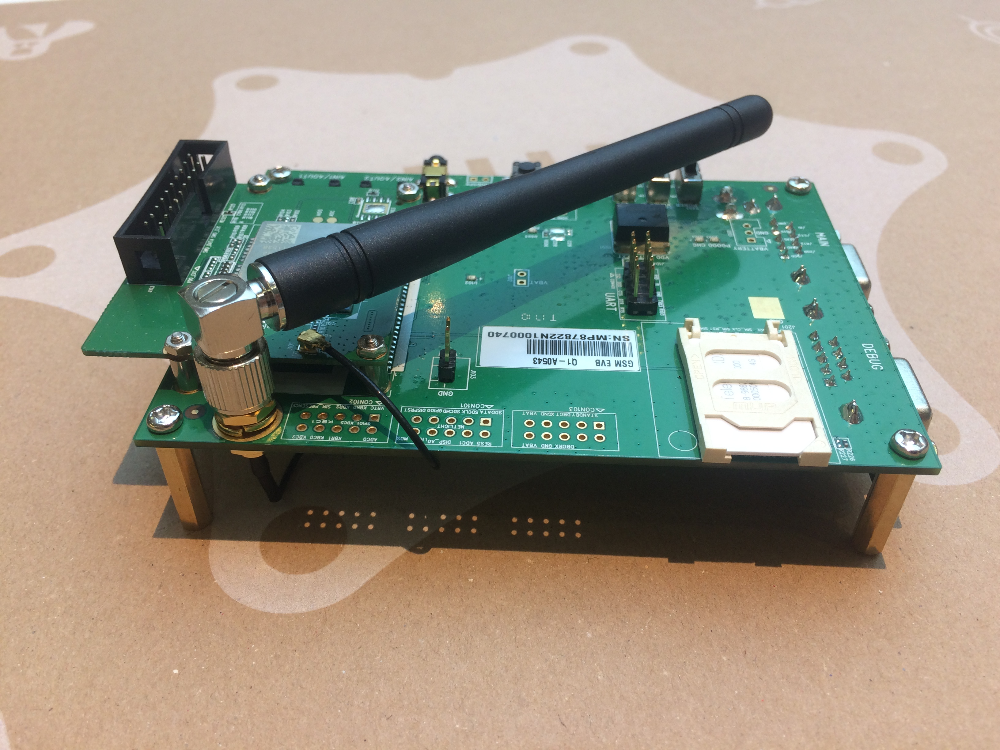

# Telekom NB-IoT Hackathon 2017

## Zusammenbau des Quectel-NB-IoT-Moduls

Dieses Dokument dient als Beschreibung für den Zusammenbau des Quectel NB-IoT Moduls, mit dessen Hilfe Daten übertragen werden können.

1. Wichtige Komponenten
2. Anschließen der Antenne
3. Fertiges Modul
4. SIM-Karte

